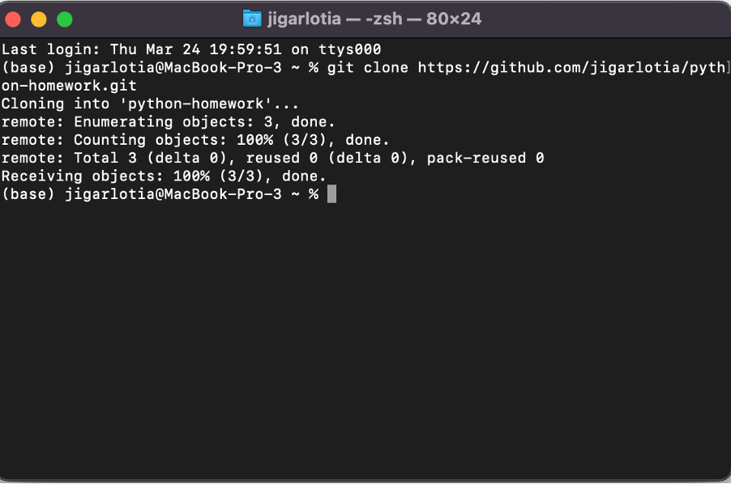
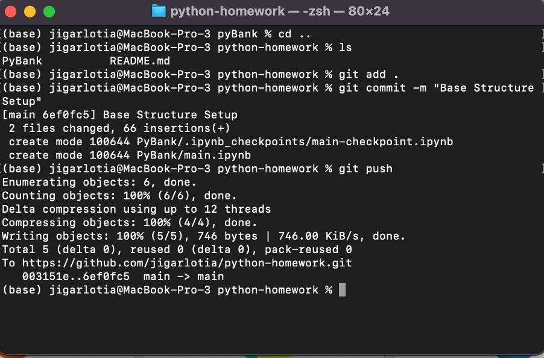
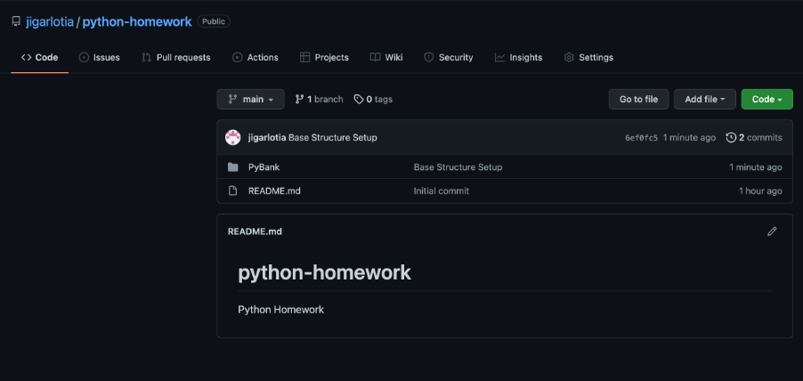

# Week 2 Homework - PyBank and PyRamen
Python Homework consisting of two folders

1. **PyBank** -  The script reads [budget_data.csv](PyBank/Data/budget_data.csv) which is composed of two columns, Date and Profit/Losses. The script then calculates the finacial metrics.

2. **PyRamen** - The script will parse through two csv files one which will have the menu details [menu_data.csv](PyRamen/Data/menu_data.csv) such as item name, cost and price and sales data [sales_data.csv](PyRamen/Data/sales_data.csv) which will have the sale of each item.

After parsing the files, the script will create a report dictionary with each menu item being the key and calculating the metrics such as total sales, revenue, cost base and profit. 

All the files are cloned from GitHub and worked locally and pushed it back up.

### Git Screenshots 

